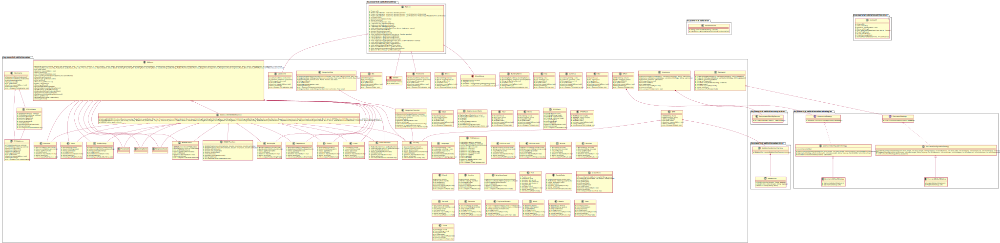

# PowerStat's validation utilities

These validation utilities should be useful value/entity classes.

## Installation

Because this library is only useful for developers the installation depends on your build environment.

For example when using Apache Maven you could add the following dependency to your project:

    <dependency>
      <groupId>de.powerstat</groupId>
      <artifactId>validation</artifactId>
      <version>3.0</version>
    </dependency>

Other build tools like gradle will work analogous.

To compile this project yourself you could use:

    mvn clean install org.pitest:pitest-maven:mutationCoverage site
    
or simply:

     mvn clean install
     
To find newer dependencies:

    mvn versions:display-dependency-updates
    
To find newer plugins:

    mvn versions:display-plugin-updates
    
To make a new release:

    mvn --batch-mode release:clean release:prepare release:perform
    git push -–tags
    git push origin master
    
To run checkstyle:

    mvn checkstyle:check
    
To run pmd:

    mvn pmd:check
    
To run spotbugs:

    mvn spotbugs:check
    
To run arch-unit:

    mvn arch-unit:arch-test
    
To run JDeprScan:

    mvn jdeprscan:jdeprscan jdeprscan:test-jdeprscan
    
To run toolchain:

    mvn toolchains:toolchain
    
If you use a sonar server:

    mvn sonar:sonar -Dsonar.login=<username> -Dsonar.password=<password>

If you use [infer][https://fbinfer.com/]:

    infer run -- mvn clean compile

## Usage

For usage in your own projects please read the Javadoc's and follow the examples in the unittests.

## Contributing

If you would like to contribute to this project please read [How to contribute](CONTRIBUTING.md).

## License

This code is licensed under the [Apache License Version 2.0](LICENSE.md).

## UML Diagram

